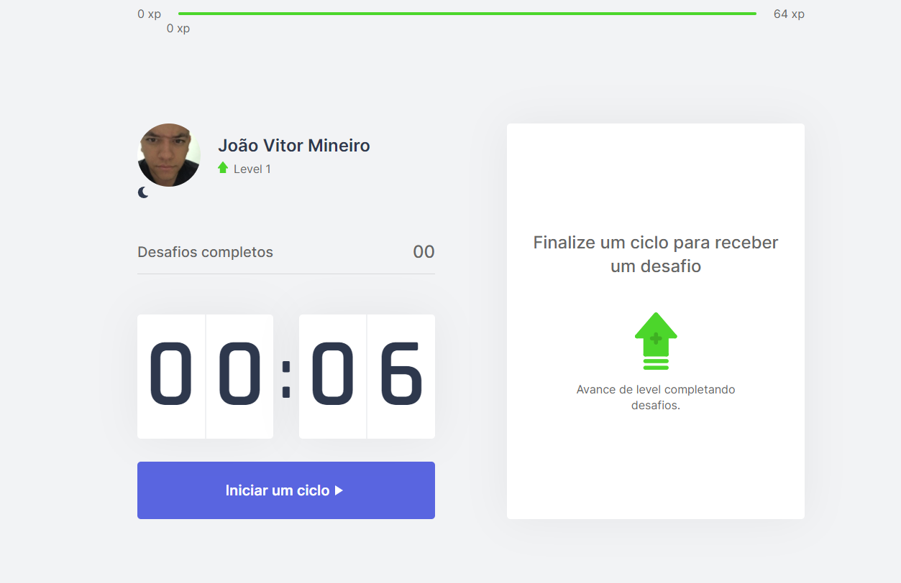

<h1 align="center">
  
</h1>

  <a href="#-tecnologias">Tecnologias</a>&nbsp;&nbsp;&nbsp;|&nbsp;&nbsp;&nbsp;
  <a href="#-projeto">Projeto</a>&nbsp;&nbsp;&nbsp;|&nbsp;&nbsp;&nbsp;
  <a href="#-layout">Layout</a>&nbsp;&nbsp;&nbsp;|&nbsp;&nbsp;&nbsp;
  <a href="#-licença">Licença</a>

  
  

 

    
    
    

## 🚀 Tecnologias

Esse projeto está sendo desenvolvido com as seguintes tecnologias:

- Next.js
- ReactJS
- TypeScript

## 💻 Projeto

O Move.it é uma aplicação gamificada de gerenciamento de tempo desenvolvida durante a Next Level Week #04 da Rocketseat, realizada durante os dias 22 a 28 de fevereiro de 2021, que utiliza um cronômetro e a conquista de xp para incentivar a divisão de um trabalho em períodos, com pausas, conforme a técnica de pomodoro.

## 🔖 Layout

Você pode visualizar o layout do projeto através [desse link](https://www.figma.com/file/ge20pu3ofMOKoliUyKx1Nl/Move.it-1.0/duplicate). Lembrando que você precisa ter uma conta no [Figma](http://figma.com/) para acessá-lo.

## 🔥 Iniciando o Projeto 

clone p projeto e vá para o folder 

`$ git clone https://github.com/jvmineiro/moveit.git`

Intale as dependencias com o comando:

`$npm i ou yarn`

And start the project with

`$ npm start ou yarn dev`

E agora você acessa a página `localhost:3000` do seu browser.

---

Por João Vitor Mineiro 